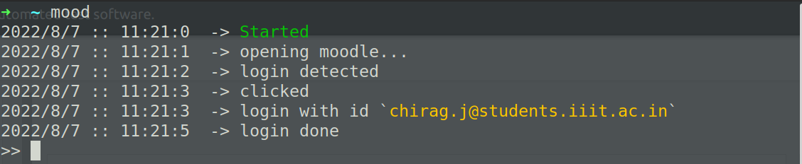
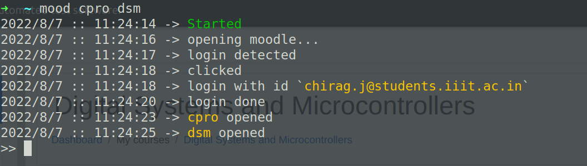
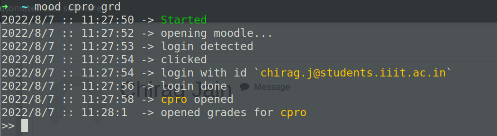
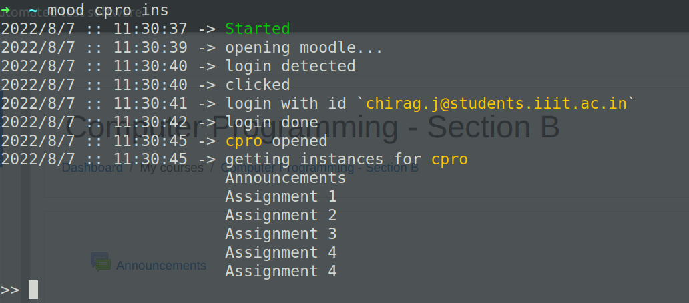
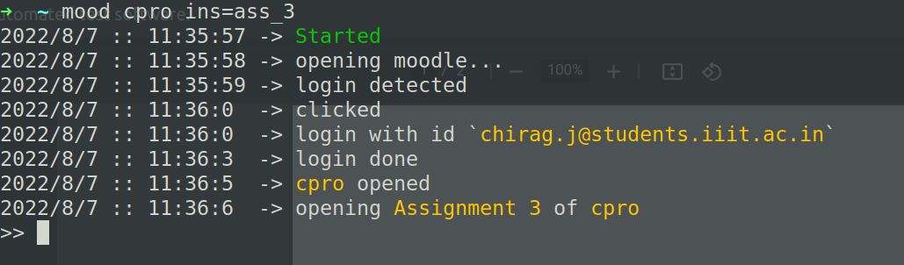

# IIITH MOODLE CONTROLLER

A command-line Python application aimed at automating IIITH moodle from login to opening assignments, grades within a single command even for multiple courses.

## **Dependencies**

### **Python**

### **Selenium**

```
$ pip install selenium
```

### **ChromeDriver**

Check Chrome version

`Help > About Google Chrome`

download chromedriver for to your chrome version

https://chromedriver.chromium.org/downloads

## **Setup**

> Open `bot/user.json` and update your email and password and absolute path for chrome driver

> Open `bot/constants.py` and upadate absolue path for `user.json` in method `get_user`

> Open `.bashrc` or any rc file in whichever terminal you are working and create an alias

```
alias mood="python <ABSOLUTE_PATH_FOR_main.py>"
```

## **Course alias**

> Computer Programming - cpro

> Digital Systems & Microcontrollers - dsm

> Discrete Structures - ds

> Data Structures & Algorithms - dsa

> Computer Systems and Organisation - cso

> Linear Alzebra - la

> Internet of Things - iot

> Introduction to Software Systems - iss

> Automata Theory - at

> Real Analsis - ra

> Probability & Statastics - ps

> Operating Systems and Networks - osn

> Value Education-1 - ve1

> Embedded Systems Workshop - esw

> Algorithm Analysis & Design - aad

> Data and Applications - da

## **Tutorial**

> Type `mood` and press enter to simply login and view moodle homepage  
> 

> Type `mood cpro dsm ...` or any series of command and press enter to login and view moodle all these courses in different tabs
> 

> Type `grd` after course alias to open grades for that course i.e `mood cpro grd` > 

> To view course contents on terminal type `ins` after course alias
> 

> To open course contents on terminal type `ins=` after course alias
> Argument to `ins` parameter need not to be exact as it uses regex with `_` as anything bw it
> i.e. type `ins=ass_3` to open `Assignment 3` for `cpro` > 

> Type `q` and press enter to exit
